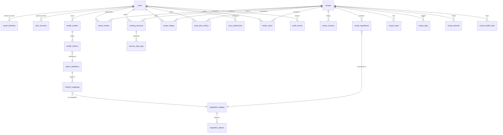

# Database Schema

> PostgreSQL 16 — all tables live in the `mfc` schema.
> UUIDs as primary keys (except recipes which use slugs), `timestamptz` for all timestamps, soft-delete via `deleted_at` where applicable.

---

## Schema Layers

| Layer | Tables | Lifecycle |
|-------|--------|-----------|
| **Identity** | `users`, `auth_sessions`, `oauth_identities` | One row per real person; sessions rotate. |
| **Health** | `health_profiles`, `health_metrics`, `metric_definitions`, `nutrient_mappings` | User-owned; mappings are reference data. |
| **Catalog** | `recipes`, `recipe_versions`, `recipe_ingredients`, `recipe_steps`, `recipe_tags`, `recipe_utensils`, `recipe_health_facts`, `recipe_nutrients`, `ingredient_catalog`, `ingredient_aliases` | Editor-owned; rarely deleted. |
| **Engagement** | `saved_recipes`, `cooking_sessions`, `session_step_logs`, `recipe_ratings`, `recipe_views`, `meal_plan_entries` | User-owned; growth-bound. |
| **Personalization** | `user_preferences` | Key-value, user-owned. |
| **Operations** | `audit_events`, `rate_limit_buckets` (Redis only — listed for completeness) | Append-only / ephemeral. |

---

## Entity-Relationship Overview



---

## Tables

### `users`

The core identity table. Mirrors the existing `{ id, name, email, avatar, provider }` contract from `shared/auth.js`.

```sql
CREATE TABLE mfc.users (
    id              UUID PRIMARY KEY DEFAULT gen_random_uuid(),
    email           CITEXT UNIQUE,                           -- nullable for Apple-private-relay users
    name            TEXT NOT NULL,
    avatar_url      TEXT,
    primary_provider TEXT NOT NULL DEFAULT 'email',          -- the provider used for original signup
    password_hash   TEXT,                                    -- only for primary_provider='email'; bcrypt
    email_verified  BOOLEAN NOT NULL DEFAULT FALSE,
    locale          TEXT NOT NULL DEFAULT 'en',
    created_at      TIMESTAMPTZ NOT NULL DEFAULT now(),
    updated_at      TIMESTAMPTZ NOT NULL DEFAULT now(),
    deleted_at      TIMESTAMPTZ                              -- soft delete; hard-delete job purges after 30 days
);

CREATE INDEX idx_users_email ON mfc.users (email) WHERE deleted_at IS NULL;
```

**Design decisions**:
- `email` uses `CITEXT` (case-insensitive) so `Aman@x.com` and `aman@x.com` collide.
- One user can have **multiple** linked OAuth identities — see `oauth_identities`. The `primary_provider` is just the original signup channel.
- Soft delete preserves referential integrity for `cooking_sessions` and `recipe_ratings`. A nightly job hard-deletes after the 30-day GDPR grace window.
- Password is bcrypt (cost 12). Empty for OAuth-only users.

---

### `oauth_identities`

A user can link Google + Apple + email accounts.

```sql
CREATE TABLE mfc.oauth_identities (
    id              UUID PRIMARY KEY DEFAULT gen_random_uuid(),
    user_id         UUID NOT NULL REFERENCES mfc.users(id) ON DELETE CASCADE,
    provider        TEXT NOT NULL CHECK (provider IN ('google', 'apple')),
    provider_uid    TEXT NOT NULL,
    email_at_link   CITEXT,                                  -- email reported by provider at link time
    linked_at       TIMESTAMPTZ NOT NULL DEFAULT now(),

    CONSTRAINT uq_provider_uid UNIQUE (provider, provider_uid)
);

CREATE INDEX idx_oauth_user ON mfc.oauth_identities (user_id);
```

---

### `auth_sessions`

Refresh-token store. Allows revocation ("sign out everywhere") and device listing.

```sql
CREATE TABLE mfc.auth_sessions (
    id              UUID PRIMARY KEY DEFAULT gen_random_uuid(),
    user_id         UUID NOT NULL REFERENCES mfc.users(id) ON DELETE CASCADE,
    refresh_token_hash TEXT NOT NULL,                        -- sha256 of the opaque refresh token
    user_agent      TEXT,
    ip_inet         INET,
    created_at      TIMESTAMPTZ NOT NULL DEFAULT now(),
    last_used_at    TIMESTAMPTZ NOT NULL DEFAULT now(),
    expires_at      TIMESTAMPTZ NOT NULL,
    revoked_at      TIMESTAMPTZ
);

CREATE INDEX idx_sessions_user ON mfc.auth_sessions (user_id) WHERE revoked_at IS NULL;
CREATE INDEX idx_sessions_expiry ON mfc.auth_sessions (expires_at) WHERE revoked_at IS NULL;
```

**Design decisions**:
- Access tokens (15 min TTL) are stateless JWTs — no DB lookup on every request.
- Refresh tokens (30-day TTL) are opaque random strings; only their sha256 is stored. The token itself is in an `httpOnly; SameSite=Strict; Secure` cookie.
- Rotation: every refresh issues a new pair and revokes the old session row. Reuse of a revoked refresh triggers a forced sign-out of all sessions for that user (token-theft signal).

---

### `health_profiles`

A user can have multiple profiles over time (e.g. "pre-pregnancy", "cutting phase"); only one is active.

```sql
CREATE TABLE mfc.health_profiles (
    id              UUID PRIMARY KEY DEFAULT gen_random_uuid(),
    user_id         UUID NOT NULL REFERENCES mfc.users(id) ON DELETE CASCADE,
    label           TEXT NOT NULL DEFAULT 'Default',
    is_active       BOOLEAN NOT NULL DEFAULT TRUE,
    created_at      TIMESTAMPTZ NOT NULL DEFAULT now(),
    updated_at      TIMESTAMPTZ NOT NULL DEFAULT now()
);

-- Enforce at most one active profile per user (partial unique index)
CREATE UNIQUE INDEX idx_one_active_profile
    ON mfc.health_profiles (user_id) WHERE is_active = TRUE;
CREATE INDEX idx_profiles_user ON mfc.health_profiles (user_id);
```

> ⚠️ A naive `UNIQUE (user_id, is_active)` would forbid two inactive profiles per user. The partial index is the correct enforcement.

---

### `metric_definitions`

Reference table for the health metrics the system understands. Seeded on deploy.

```sql
CREATE TABLE mfc.metric_definitions (
    id              TEXT PRIMARY KEY,                        -- 'iron', 'b12', 'sodium', 'fiber'
    name            TEXT NOT NULL,                           -- 'Iron', 'B12'
    sub_label       TEXT,                                    -- 'Below range', 'Within range' (matches UI's `sub` field)
    unit            TEXT NOT NULL,                           -- 'g/dL', 'pg/mL', '%', 'g'
    default_target  NUMERIC,
    direction       TEXT NOT NULL DEFAULT 'increase'         -- 'increase' | 'decrease' | 'maintain'
        CHECK (direction IN ('increase', 'decrease', 'maintain')),
    description     TEXT,
    category        TEXT NOT NULL DEFAULT 'micronutrient'    -- 'micronutrient' | 'macronutrient' | 'lifestyle'
        CHECK (category IN ('micronutrient', 'macronutrient', 'lifestyle')),
    sort_order      INT NOT NULL DEFAULT 0,
    is_active       BOOLEAN NOT NULL DEFAULT TRUE
);
```

**Seed data** (matches the current `HEALTH_METRICS` array in `index.html:618`):

| id | name | sub_label | unit | default_target | direction | category |
|----|------|-----------|------|----------------|-----------|----------|
| `iron` | Iron | Below range | g/dL | 12.0 | increase | micronutrient |
| `b12` | B12 | Within range | pg/mL | 500 | increase | micronutrient |
| `sodium` | Sodium watch | Reduce intake | % | -15 | decrease | micronutrient |
| `fiber` | Fiber goal | Increase daily | g | 25 | increase | macronutrient |

---

### `health_metrics`

Per-user metric values within a health profile.

```sql
CREATE TABLE mfc.health_metrics (
    id              UUID PRIMARY KEY DEFAULT gen_random_uuid(),
    profile_id      UUID NOT NULL REFERENCES mfc.health_profiles(id) ON DELETE CASCADE,
    metric_id       TEXT NOT NULL REFERENCES mfc.metric_definitions(id),
    value           NUMERIC NOT NULL,                        -- current measurement
    target          NUMERIC,                                 -- user override of default_target
    is_active       BOOLEAN NOT NULL DEFAULT TRUE,           -- maps to the toggle state in the UI
    recorded_at     TIMESTAMPTZ NOT NULL DEFAULT now(),
    source          TEXT NOT NULL DEFAULT 'manual'           -- 'manual' | 'apple_health' | 'google_fit' | 'lab_import'
        CHECK (source IN ('manual', 'apple_health', 'google_fit', 'lab_import')),

    CONSTRAINT uq_profile_metric UNIQUE (profile_id, metric_id)
);

CREATE INDEX idx_health_metrics_profile ON mfc.health_metrics (profile_id);
```

---

### `nutrient_mappings`

The personalization engine ([07-personalization-engine.md](07-personalization-engine.md)) needs to know **which ingredients/tags satisfy which health metric**. Today this knowledge is hardcoded in `PERSONA_MEALS`. We move it to data so we can ship new metrics without a frontend deploy.

```sql
CREATE TABLE mfc.nutrient_mappings (
    id              UUID PRIMARY KEY DEFAULT gen_random_uuid(),
    metric_id       TEXT NOT NULL REFERENCES mfc.metric_definitions(id),
    target_kind     TEXT NOT NULL CHECK (target_kind IN ('ingredient', 'tag', 'cuisine')),
    target_value    TEXT NOT NULL,                           -- ingredient_id (slug) | tag | cuisine
    affinity        NUMERIC NOT NULL,                        -- positive = boosts; negative = penalizes
    note            TEXT,                                    -- 'Spinach is iron-rich'
    created_at      TIMESTAMPTZ NOT NULL DEFAULT now(),

    CONSTRAINT uq_metric_target UNIQUE (metric_id, target_kind, target_value)
);

CREATE INDEX idx_nutrient_mappings_metric ON mfc.nutrient_mappings (metric_id);
CREATE INDEX idx_nutrient_mappings_target ON mfc.nutrient_mappings (target_kind, target_value);
```

**Example seed rows**:

| metric_id | target_kind | target_value | affinity | note |
|-----------|-------------|--------------|----------|------|
| `iron` | ingredient | `spinach` | +2.0 | High heme-iron-bioavailable when paired with vitamin C |
| `iron` | ingredient | `lentils` | +1.5 | |
| `iron` | tag | `iron-rich` | +3.0 | |
| `b12` | ingredient | `paneer` | +1.5 | |
| `b12` | ingredient | `salmon` | +2.5 | |
| `sodium` | tag | `low-sodium` | +3.0 | |
| `sodium` | ingredient | `soy-sauce` | -2.0 | |
| `fiber` | ingredient | `chickpeas` | +2.0 | |
| `fiber` | tag | `high-fiber` | +3.0 | |

---

### `ingredient_catalog`

A canonical ingredient table. Recipes reference it (where possible) so we can:
- Aggregate shopping lists across meal-plan entries.
- Power the nutrient-mapping engine.
- Surface "recipes containing X" search.

```sql
CREATE TABLE mfc.ingredient_catalog (
    id              TEXT PRIMARY KEY,                        -- slug: 'paneer', 'tomato-ripe'
    canonical_name  TEXT NOT NULL,                           -- 'Paneer'
    category        TEXT,                                    -- 'dairy', 'spice', 'aromatic', 'protein'
    default_unit    TEXT,                                    -- 'g', 'tbsp', 'piece'
    created_at      TIMESTAMPTZ NOT NULL DEFAULT now()
);

CREATE INDEX idx_ingredient_category ON mfc.ingredient_catalog (category);
```

### `ingredient_aliases`

Many ways to write "tomato" — we normalize at import.

```sql
CREATE TABLE mfc.ingredient_aliases (
    alias           TEXT PRIMARY KEY,                        -- lowercase exact match: 'tomatoes (ripe)', 'roma tomatoes'
    ingredient_id   TEXT NOT NULL REFERENCES mfc.ingredient_catalog(id) ON DELETE CASCADE
);
```

> Migration tooling normalizes existing recipe ingredients via a one-time import script (see [05-migration-plan.md](05-migration-plan.md)).

---

### `recipes`

Master recipe record. Slug-keyed so existing URLs (`recipe.html?id=paneer-butter-masala`) continue to work.

```sql
CREATE TABLE mfc.recipes (
    id              TEXT PRIMARY KEY,                        -- slug: 'paneer-butter-masala'
    name            TEXT NOT NULL,
    tagline         TEXT NOT NULL,
    cuisine         TEXT NOT NULL,
    difficulty      TEXT NOT NULL CHECK (difficulty IN ('Easy', 'Medium', 'Hard')),
    servings        INT NOT NULL DEFAULT 4,
    total_minutes   INT NOT NULL,
    emoji           TEXT,
    color           TEXT,
    color_soft      TEXT,
    featured        BOOLEAN NOT NULL DEFAULT FALSE,
    highlight       TEXT,
    hero_image_url  TEXT,
    hero_caption    TEXT,
    hero_alt        TEXT,
    hero_palette    JSONB NOT NULL DEFAULT '[]',
    hero_fit        JSONB NOT NULL DEFAULT '{}',
    card_image_url  TEXT,
    card_alt        TEXT,
    card_fit        JSONB NOT NULL DEFAULT '{}',
    is_published    BOOLEAN NOT NULL DEFAULT TRUE,
    current_version INT NOT NULL DEFAULT 1,                  -- bumps on each material edit
    created_at      TIMESTAMPTZ NOT NULL DEFAULT now(),
    updated_at      TIMESTAMPTZ NOT NULL DEFAULT now()
);

CREATE INDEX idx_recipes_cuisine ON mfc.recipes (cuisine);
CREATE INDEX idx_recipes_difficulty ON mfc.recipes (difficulty);
CREATE INDEX idx_recipes_featured ON mfc.recipes (featured) WHERE featured = TRUE;
CREATE INDEX idx_recipes_published ON mfc.recipes (is_published) WHERE is_published = TRUE;

-- Full-text search (powers the search bar in recipe-search.html)
ALTER TABLE mfc.recipes ADD COLUMN search_vector TSVECTOR
    GENERATED ALWAYS AS (
        setweight(to_tsvector('english', coalesce(name, '')),    'A') ||
        setweight(to_tsvector('english', coalesce(tagline, '')), 'B') ||
        setweight(to_tsvector('english', coalesce(cuisine, '')), 'C')
    ) STORED;

CREATE INDEX idx_recipes_search ON mfc.recipes USING GIN (search_vector);
```

---

### `recipe_versions`

Snapshot of a recipe at a published point. Solves: a user starts cooking version N, admin edits to version N+1; the in-progress session must continue to see N until completion.

```sql
CREATE TABLE mfc.recipe_versions (
    recipe_id       TEXT NOT NULL REFERENCES mfc.recipes(id) ON DELETE CASCADE,
    version         INT NOT NULL,
    snapshot        JSONB NOT NULL,                          -- full denormalized recipe doc at publish time
    published_at    TIMESTAMPTZ NOT NULL DEFAULT now(),
    PRIMARY KEY (recipe_id, version)
);
```

**Cooking sessions** carry a `recipe_version` so resume always shows the same content. New sessions always read the latest version.

---

### `recipe_tags`

```sql
CREATE TABLE mfc.recipe_tags (
    recipe_id   TEXT NOT NULL REFERENCES mfc.recipes(id) ON DELETE CASCADE,
    tag         TEXT NOT NULL,                               -- 'vegetarian', 'non-veg', 'gluten-free', 'high-protein'
    PRIMARY KEY (recipe_id, tag)
);
CREATE INDEX idx_recipe_tags_tag ON mfc.recipe_tags (tag);
```

---

### `recipe_ingredients`

```sql
CREATE TABLE mfc.recipe_ingredients (
    id              UUID PRIMARY KEY DEFAULT gen_random_uuid(),
    recipe_id       TEXT NOT NULL REFERENCES mfc.recipes(id) ON DELETE CASCADE,
    ingredient_id   TEXT REFERENCES mfc.ingredient_catalog(id),  -- nullable: free-form fallback
    name            TEXT NOT NULL,                           -- display name as authored ('Tomatoes (ripe)')
    amount          TEXT NOT NULL,                           -- '300g', '1 large', 'to taste'
    amount_value    NUMERIC,                                 -- parsed where possible (300, 1)
    amount_unit     TEXT,                                    -- parsed unit ('g', 'large')
    group_name      TEXT NOT NULL DEFAULT 'main'             -- 'main' | 'fat' | 'aromatics' | 'spice'
        CHECK (group_name IN ('main', 'fat', 'aromatics', 'spice', 'garnish')),
    sort_order      INT NOT NULL DEFAULT 0
);

CREATE INDEX idx_recipe_ingredients_recipe ON mfc.recipe_ingredients (recipe_id);
CREATE INDEX idx_recipe_ingredients_ingredient ON mfc.recipe_ingredients (ingredient_id) WHERE ingredient_id IS NOT NULL;
```

> `name` (free-form) preserves authorial voice; `ingredient_id` (when matched) powers shopping-list aggregation. The recipe-detail API serializes both as the existing JSON shape — `ingredient_id` is internal.

---

### `recipe_steps`

```sql
CREATE TABLE mfc.recipe_steps (
    id              UUID PRIMARY KEY DEFAULT gen_random_uuid(),
    recipe_id       TEXT NOT NULL REFERENCES mfc.recipes(id) ON DELETE CASCADE,
    step_number     INT NOT NULL,
    title           TEXT NOT NULL,
    detail          TEXT NOT NULL,
    duration        INT NOT NULL,                            -- seconds
    tip             TEXT,
    image_url       TEXT,
    image_alt       TEXT,
    image_caption   TEXT,

    CONSTRAINT uq_recipe_step UNIQUE (recipe_id, step_number)
);

CREATE INDEX idx_recipe_steps_recipe ON mfc.recipe_steps (recipe_id);
```

---

### `recipe_utensils`

```sql
CREATE TABLE mfc.recipe_utensils (
    id          UUID PRIMARY KEY DEFAULT gen_random_uuid(),
    recipe_id   TEXT NOT NULL REFERENCES mfc.recipes(id) ON DELETE CASCADE,
    name        TEXT NOT NULL,
    essential   BOOLEAN NOT NULL DEFAULT FALSE,
    sort_order  INT NOT NULL DEFAULT 0
);
CREATE INDEX idx_recipe_utensils_recipe ON mfc.recipe_utensils (recipe_id);
```

---

### `recipe_health_facts`

```sql
CREATE TABLE mfc.recipe_health_facts (
    id          UUID PRIMARY KEY DEFAULT gen_random_uuid(),
    recipe_id   TEXT NOT NULL REFERENCES mfc.recipes(id) ON DELETE CASCADE,
    fact        TEXT NOT NULL,
    sort_order  INT NOT NULL DEFAULT 0
);
CREATE INDEX idx_recipe_health_facts_recipe ON mfc.recipe_health_facts (recipe_id);
```

---

### `recipe_nutrients`

Per-serving nutrient values per recipe. Powers the `microTargets()` ring percentages in the `Personalize` component. See [07-personalization-engine.md](07-personalization-engine.md) for usage.

```sql
CREATE TABLE mfc.recipe_nutrients (
    recipe_id   TEXT NOT NULL REFERENCES mfc.recipes(id) ON DELETE CASCADE,
    metric_id   TEXT NOT NULL REFERENCES mfc.metric_definitions(id),
    value       NUMERIC NOT NULL,                            -- per-serving in metric_definitions.unit
    confidence  TEXT NOT NULL DEFAULT 'estimated'            -- 'measured' | 'estimated' | 'imputed'
        CHECK (confidence IN ('measured', 'estimated', 'imputed')),
    updated_at  TIMESTAMPTZ NOT NULL DEFAULT now(),

    PRIMARY KEY (recipe_id, metric_id)
);
CREATE INDEX idx_recipe_nutrients_metric ON mfc.recipe_nutrients (metric_id);
```

> V1 values are imported from a one-off LLM-assisted script with content-team review; future authoring captures measurements where possible.

---

### `saved_recipes`

```sql
CREATE TABLE mfc.saved_recipes (
    user_id     UUID NOT NULL REFERENCES mfc.users(id) ON DELETE CASCADE,
    recipe_id   TEXT NOT NULL REFERENCES mfc.recipes(id) ON DELETE CASCADE,
    saved_at    TIMESTAMPTZ NOT NULL DEFAULT now(),
    notes       TEXT,
    PRIMARY KEY (user_id, recipe_id)
);
CREATE INDEX idx_saved_recipes_user ON mfc.saved_recipes (user_id, saved_at DESC);
```

---

### `cooking_sessions`

```sql
CREATE TABLE mfc.cooking_sessions (
    id              UUID PRIMARY KEY DEFAULT gen_random_uuid(),
    user_id         UUID NOT NULL REFERENCES mfc.users(id) ON DELETE CASCADE,
    recipe_id       TEXT NOT NULL REFERENCES mfc.recipes(id) ON DELETE CASCADE,
    recipe_version  INT NOT NULL,                            -- version pinned at start
    started_at      TIMESTAMPTZ NOT NULL DEFAULT now(),
    completed_at    TIMESTAMPTZ,
    last_active_at  TIMESTAMPTZ NOT NULL DEFAULT now(),      -- heartbeat for resume detection
    servings_cooked INT,
    completion_pct  INT NOT NULL DEFAULT 0 CHECK (completion_pct BETWEEN 0 AND 100),
    last_step       INT NOT NULL DEFAULT 1,                  -- for cross-device resume
    status          TEXT NOT NULL DEFAULT 'in_progress'
        CHECK (status IN ('in_progress', 'completed', 'abandoned'))
);

CREATE INDEX idx_cooking_sessions_user ON mfc.cooking_sessions (user_id, started_at DESC);
CREATE INDEX idx_cooking_sessions_active ON mfc.cooking_sessions (user_id, recipe_id) WHERE status = 'in_progress';
```

> Idle in-progress sessions older than 24 hours are auto-marked `abandoned` by a daily job.

---

### `session_step_logs`

```sql
CREATE TABLE mfc.session_step_logs (
    id              UUID PRIMARY KEY DEFAULT gen_random_uuid(),
    session_id      UUID NOT NULL REFERENCES mfc.cooking_sessions(id) ON DELETE CASCADE,
    step_number     INT NOT NULL,
    started_at      TIMESTAMPTZ,
    completed_at    TIMESTAMPTZ,
    timer_used      BOOLEAN NOT NULL DEFAULT FALSE,
    skipped         BOOLEAN NOT NULL DEFAULT FALSE,

    CONSTRAINT uq_session_step UNIQUE (session_id, step_number)
);
CREATE INDEX idx_session_steps_session ON mfc.session_step_logs (session_id);
```

---

### `recipe_ratings`

```sql
CREATE TABLE mfc.recipe_ratings (
    user_id     UUID NOT NULL REFERENCES mfc.users(id) ON DELETE CASCADE,
    recipe_id   TEXT NOT NULL REFERENCES mfc.recipes(id) ON DELETE CASCADE,
    rating      INT NOT NULL CHECK (rating BETWEEN 1 AND 5),
    review      TEXT,
    created_at  TIMESTAMPTZ NOT NULL DEFAULT now(),
    updated_at  TIMESTAMPTZ NOT NULL DEFAULT now(),
    PRIMARY KEY (user_id, recipe_id)
);
CREATE INDEX idx_ratings_recipe ON mfc.recipe_ratings (recipe_id);
```

A materialized view (`recipe_rating_stats`) is refreshed every 15 min for the recipe-list `avg_rating` column. Single-recipe detail reads compute on the fly.

---

### `recipe_views`

Rolling view counter. Anonymous views increment by IP-day uniqueness (Redis); logged-in views by user-day.

```sql
CREATE TABLE mfc.recipe_views (
    recipe_id   TEXT NOT NULL REFERENCES mfc.recipes(id) ON DELETE CASCADE,
    bucket_date DATE NOT NULL,
    user_id     UUID REFERENCES mfc.users(id) ON DELETE SET NULL,  -- NULL for anonymous
    view_count  INT NOT NULL DEFAULT 1,

    PRIMARY KEY (recipe_id, bucket_date, COALESCE(user_id, '00000000-0000-0000-0000-000000000000'::uuid))
);
CREATE INDEX idx_views_recipe_date ON mfc.recipe_views (recipe_id, bucket_date DESC);
```

> Inserted via `INSERT ... ON CONFLICT DO UPDATE`. Daily aggregation job rolls up to a `recipe_popularity` view used by recommendation tie-breakers.

---

### `meal_plan_entries`

```sql
CREATE TABLE mfc.meal_plan_entries (
    id          UUID PRIMARY KEY DEFAULT gen_random_uuid(),
    user_id     UUID NOT NULL REFERENCES mfc.users(id) ON DELETE CASCADE,
    recipe_id   TEXT NOT NULL REFERENCES mfc.recipes(id) ON DELETE CASCADE,
    plan_date   DATE NOT NULL,
    meal_slot   TEXT NOT NULL DEFAULT 'lunch'
        CHECK (meal_slot IN ('breakfast', 'lunch', 'dinner', 'snack')),
    servings    INT NOT NULL DEFAULT 1,
    created_at  TIMESTAMPTZ NOT NULL DEFAULT now(),

    CONSTRAINT uq_meal_slot UNIQUE (user_id, plan_date, meal_slot)
);
CREATE INDEX idx_meal_plan_user_date ON mfc.meal_plan_entries (user_id, plan_date);
```

---

### `user_preferences`

Key-value store for tweak-panel state, default servings, last-cooked-step pinning, etc.

```sql
CREATE TABLE mfc.user_preferences (
    user_id     UUID NOT NULL REFERENCES mfc.users(id) ON DELETE CASCADE,
    key         TEXT NOT NULL,                               -- 'tweak.accent', 'tweak.density', 'default_servings'
    value       JSONB NOT NULL,
    updated_at  TIMESTAMPTZ NOT NULL DEFAULT now(),
    PRIMARY KEY (user_id, key)
);
```

> Namespaced keys (`tweak.*`, `cook.*`, `pref.*`) keep things organized as the surface grows.

---

### `audit_events`

Append-only event stream. Powers the admin analytics view and incident debugging.

```sql
CREATE TABLE mfc.audit_events (
    id              UUID PRIMARY KEY DEFAULT gen_random_uuid(),
    user_id         UUID REFERENCES mfc.users(id) ON DELETE SET NULL,
    event_type      TEXT NOT NULL,                           -- 'auth.signup', 'recipe.view', 'cook.start', 'cook.complete'
    entity_type     TEXT,                                    -- 'recipe', 'session'
    entity_id       TEXT,
    payload         JSONB NOT NULL DEFAULT '{}',
    occurred_at     TIMESTAMPTZ NOT NULL DEFAULT now(),
    request_id      TEXT                                     -- correlation with structured logs
);

CREATE INDEX idx_audit_user ON mfc.audit_events (user_id, occurred_at DESC);
CREATE INDEX idx_audit_type ON mfc.audit_events (event_type, occurred_at DESC);
```

> Partitioned monthly via `pg_partman`. Older partitions compressed and retained 13 months, then dropped.

---

## Index Strategy Summary

| Index | Purpose |
|-------|---------|
| `idx_recipes_search` (GIN) | Weighted full-text search on name + tagline + cuisine |
| `idx_recipes_cuisine` / `idx_recipes_difficulty` | Filter chips on `recipe-search.html` |
| `idx_recipes_featured` (partial) | Hero card on landing |
| `idx_recipe_tags_tag` | Filter by `vegetarian` / `non-veg` / etc. |
| `idx_one_active_profile` (partial unique) | Single-active-profile invariant |
| `idx_health_metrics_profile` | Metric load on profile page |
| `idx_cooking_sessions_active` (partial) | Resume-on-device lookup |
| `idx_cooking_sessions_user` | History page newest-first |
| `idx_saved_recipes_user` | My-recipes library |
| `idx_meal_plan_user_date` | Calendar view |
| `idx_nutrient_mappings_metric` | Personalization scoring |
| `idx_audit_type` | Admin event drill-down |

---

## Data Migration

The existing static JSON files map cleanly to the schema. See [05-migration-plan.md](05-migration-plan.md) for the import script details.

| Source | Target table(s) |
|--------|-----------------|
| `data/recipes.json` (list metadata) | `recipes` (insert), `recipe_tags` |
| `data/recipe-bundles/{id}/recipe.json` (full detail) | `recipes` (update), `recipe_ingredients`, `recipe_steps`, `recipe_utensils`, `recipe_health_facts`, `recipe_versions` v1 snapshot |
| `data/recipe-bundles/{id}/hero.jpg`, `step-*.jpg` | Upload to object storage; persist URLs to `hero_image_url` / `image_url` |
| `index.html` `HEALTH_METRICS` array | `metric_definitions` seed |
| `index.html` `PERSONA_MEALS` lookup | Decomposed into `nutrient_mappings` rows (one-time export script) |
| `shared/auth.js` localStorage users | None — those are demo-mode local accounts; users sign up fresh. |

---

## Extensions Required

```sql
CREATE EXTENSION IF NOT EXISTS pgcrypto;     -- gen_random_uuid()
CREATE EXTENSION IF NOT EXISTS citext;        -- case-insensitive email
CREATE EXTENSION IF NOT EXISTS pg_trgm;       -- trigram fuzzy match (recipe name similarity)
CREATE EXTENSION IF NOT EXISTS pg_partman;    -- audit_events partitioning
```
