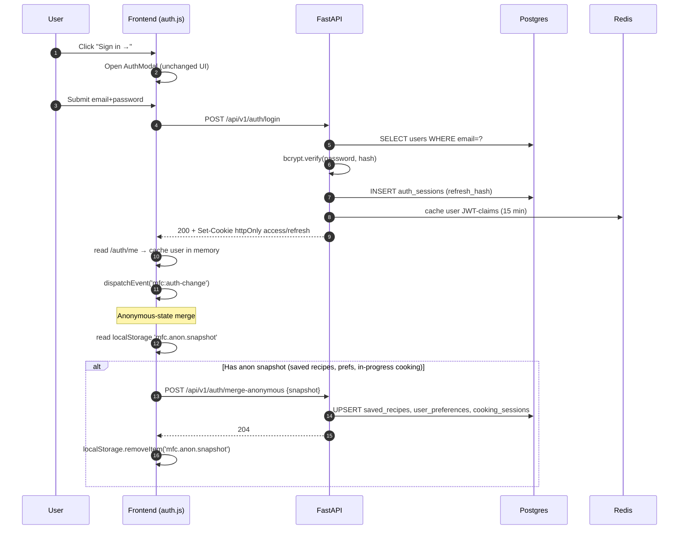
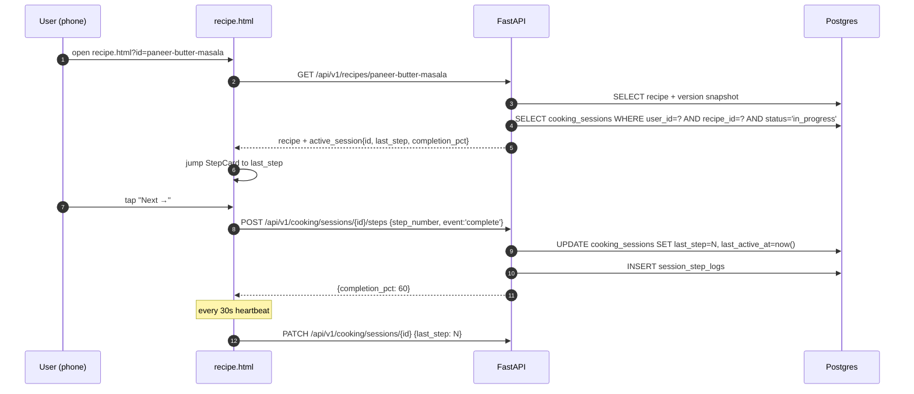
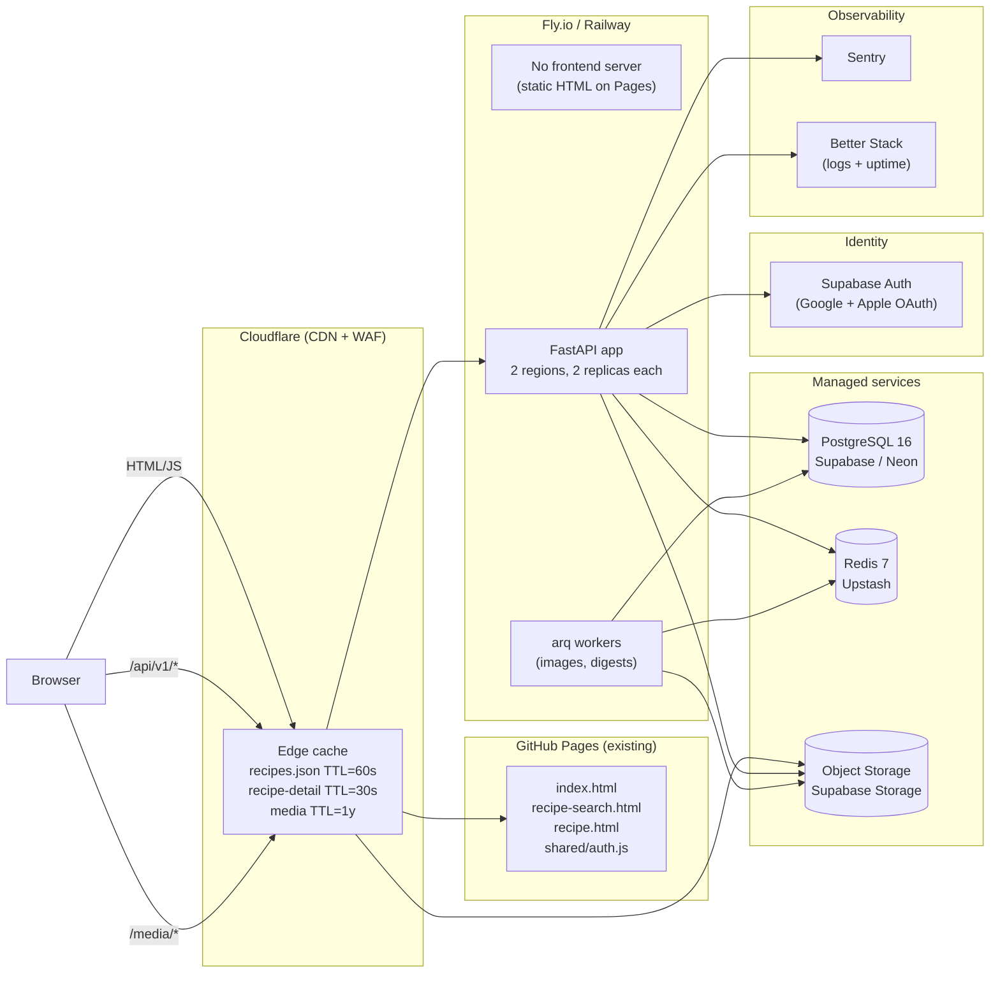

# Class Diagram & Architecture

> Domain models (SQLAlchemy ORM), service layer, sequence diagrams, and deployment topology.
> All models live in `backend/models/`, services in `backend/services/`.

---

## Domain Model Diagram

```mermaid
classDiagram
    direction LR

    class User {
        +UUID id
        +String email
        +String name
        +String avatar_url
        +String primary_provider
        +String password_hash
        +Boolean email_verified
        +String locale
        +DateTime created_at
        +DateTime updated_at
        +DateTime deleted_at
        --
        +HealthProfile active_profile()
        +List~OAuthIdentity~ oauth_identities()
        +List~AuthSession~ sessions()
        +List~SavedRecipe~ saved_recipes()
        +List~CookingSession~ cooking_history()
        +Dict preferences()
    }

    class OAuthIdentity {
        +UUID id
        +UUID user_id
        +String provider
        +String provider_uid
        +String email_at_link
        +DateTime linked_at
    }

    class AuthSession {
        +UUID id
        +UUID user_id
        +String refresh_token_hash
        +String user_agent
        +String ip_inet
        +DateTime created_at
        +DateTime last_used_at
        +DateTime expires_at
        +DateTime revoked_at
    }

    class HealthProfile {
        +UUID id
        +UUID user_id
        +String label
        +Boolean is_active
        --
        +List~HealthMetric~ metrics()
        +List~String~ active_flag_ids()
    }

    class MetricDefinition {
        +String id
        +String name
        +String sub_label
        +String unit
        +Decimal default_target
        +String direction
        +String category
        +Int sort_order
    }

    class HealthMetric {
        +UUID id
        +UUID profile_id
        +String metric_id
        +Decimal value
        +Decimal target
        +Boolean is_active
        +String source
    }

    class NutrientMapping {
        +UUID id
        +String metric_id
        +String target_kind
        +String target_value
        +Decimal affinity
        +String note
    }

    class IngredientCatalog {
        +String id
        +String canonical_name
        +String category
        +String default_unit
    }

    class IngredientAlias {
        +String alias
        +String ingredient_id
    }

    class Recipe {
        +String id
        +String name
        +String tagline
        +String cuisine
        +String difficulty
        +Int servings
        +Int total_minutes
        +String emoji
        +String color
        +Boolean featured
        +String highlight
        +String hero_image_url
        +Int current_version
        +Boolean is_published
        --
        +List~RecipeIngredient~ ingredients()
        +List~RecipeStep~ steps()
        +List~String~ tags()
        +List~RecipeUtensil~ utensils()
        +List~String~ health_facts()
        +RecipeVersion latest_snapshot()
    }

    class RecipeVersion {
        +String recipe_id
        +Int version
        +JSONB snapshot
        +DateTime published_at
    }

    class RecipeIngredient {
        +UUID id
        +String recipe_id
        +String ingredient_id
        +String name
        +String amount
        +Decimal amount_value
        +String amount_unit
        +String group_name
    }

    class RecipeStep {
        +UUID id
        +String recipe_id
        +Int step_number
        +String title
        +String detail
        +Int duration
        +String tip
        +String image_url
    }

    class RecipeUtensil {
        +UUID id
        +String recipe_id
        +String name
        +Boolean essential
    }

    class RecipeTag {
        +String recipe_id
        +String tag
    }

    class RecipeHealthFact {
        +UUID id
        +String recipe_id
        +String fact
    }

    class SavedRecipe {
        +UUID user_id
        +String recipe_id
        +DateTime saved_at
        +String notes
    }

    class CookingSession {
        +UUID id
        +UUID user_id
        +String recipe_id
        +Int recipe_version
        +DateTime started_at
        +DateTime completed_at
        +DateTime last_active_at
        +Int servings_cooked
        +Int completion_pct
        +Int last_step
        +String status
        --
        +List~SessionStepLog~ step_logs()
    }

    class SessionStepLog {
        +UUID id
        +UUID session_id
        +Int step_number
        +DateTime started_at
        +DateTime completed_at
        +Boolean timer_used
        +Boolean skipped
    }

    class RecipeRating {
        +UUID user_id
        +String recipe_id
        +Int rating
        +String review
    }

    class MealPlanEntry {
        +UUID id
        +UUID user_id
        +String recipe_id
        +Date plan_date
        +String meal_slot
        +Int servings
    }

    class UserPreference {
        +UUID user_id
        +String key
        +JSONB value
    }

    class AuditEvent {
        +UUID id
        +UUID user_id
        +String event_type
        +String entity_type
        +String entity_id
        +JSONB payload
        +DateTime occurred_at
    }

    User "1" --> "*" OAuthIdentity
    User "1" --> "*" AuthSession
    User "1" --> "*" HealthProfile
    User "1" --> "*" SavedRecipe
    User "1" --> "*" CookingSession
    User "1" --> "*" RecipeRating
    User "1" --> "*" MealPlanEntry
    User "1" --> "*" UserPreference
    User "1" --> "*" AuditEvent

    HealthProfile "1" --> "*" HealthMetric
    HealthMetric "*" --> "1" MetricDefinition
    MetricDefinition "1" --> "*" NutrientMapping
    NutrientMapping "*" --> "0..1" IngredientCatalog : target_value=ingredient_id

    Recipe "1" --> "*" RecipeVersion
    Recipe "1" --> "*" RecipeIngredient
    Recipe "1" --> "*" RecipeStep
    Recipe "1" --> "*" RecipeTag
    Recipe "1" --> "*" RecipeUtensil
    Recipe "1" --> "*" RecipeHealthFact
    Recipe "1" --> "*" SavedRecipe
    Recipe "1" --> "*" CookingSession
    Recipe "1" --> "*" RecipeRating
    Recipe "1" --> "*" MealPlanEntry

    RecipeIngredient "*" --> "0..1" IngredientCatalog
    IngredientCatalog "1" --> "*" IngredientAlias

    CookingSession "1" --> "*" SessionStepLog
```



---

## Service Layer Diagram

```mermaid
classDiagram
    direction TB

    class AuthService {
        +sign_up(email, password, name) AuthResult
        +sign_in(email, password) AuthResult
        +oauth_initiate(provider) RedirectURL
        +oauth_callback(provider, code) AuthResult
        +refresh(refresh_token) AuthResult
        +sign_out(session_id) void
        +sign_out_all(user_id) void
        +get_current_user(access_token) User
        +verify_email(token) void
        +request_password_reset(email) void
        +reset_password(token, new_password) void
        +delete_account(user_id) void
        +merge_anonymous_state(user_id, payload) void
    }

    class UserService {
        +get_profile(user_id) User
        +update_profile(user_id, data) User
        +get_preferences(user_id) Dict
        +set_preference(user_id, key, value) void
        +bulk_set_preferences(user_id, prefs) void
        +export_data(user_id) DataDump
    }

    class HealthService {
        +get_active_profile(user_id) HealthProfile
        +create_profile(user_id, label) HealthProfile
        +list_profiles(user_id) List~HealthProfile~
        +set_active(user_id, profile_id) void
        +upsert_metric(profile_id, metric_id, value, target, source) HealthMetric
        +toggle_metric(profile_id, metric_id, active) HealthMetric
        +get_active_flags(user_id) List~String~
        +sync_apple_health(user_id, payload) void
        +sync_google_fit(user_id, payload) void
    }

    class RecipeService {
        +list(filters, search, page, limit, user) PaginatedResult~Recipe~
        +get(recipe_id, user) RecipeDetail
        +get_featured() List~Recipe~
        +search_fulltext(query) List~Recipe~
        +log_view(recipe_id, user_or_ip) void
    }

    class PersonalizationService {
        +recommend(user_id) RecommendedMeal
        +rank_recipes(user_id, recipe_ids) List~ScoredRecipe~
        +compute_micro_targets(active_flags) List~MicroTarget~
        +explain_recommendation(recipe, active_flags) String
    }

    class CookingService {
        +start_session(user_id, recipe_id, servings) CookingSession
        +get_active_session(user_id, recipe_id) CookingSession
        +log_step(session_id, step_number, event) SessionStepLog
        +heartbeat(session_id, last_step) void
        +complete_session(session_id) CookingSession
        +abandon_session(session_id) CookingSession
        +get_history(user_id, limit) List~CookingSession~
    }

    class SavedRecipeService {
        +save(user_id, recipe_id, notes) SavedRecipe
        +unsave(user_id, recipe_id) void
        +list(user_id) List~SavedRecipe~
        +is_saved(user_id, recipe_id) Boolean
    }

    class RatingService {
        +rate(user_id, recipe_id, rating, review) RecipeRating
        +get_user_rating(user_id, recipe_id) RecipeRating
        +get_recipe_stats(recipe_id) RatingStats
    }

    class MealPlanService {
        +add_entry(user_id, recipe_id, date, slot, servings) MealPlanEntry
        +remove_entry(entry_id) void
        +get_week(user_id, start_date) List~MealPlanEntry~
        +get_shopping_list(user_id, start, end) ShoppingList
    }

    class MediaService {
        +upload(file, kind, owner) MediaURL
        +signed_url(path, ttl) String
        +purge(path) void
    }

    AuthService --> UserService : creates user
    AuthService --> AuditService : logs events
    PersonalizationService --> HealthService : reads flags
    PersonalizationService --> RecipeService : scores recipes
    CookingService --> RecipeService : pins recipe_version
    UserService --> AuditService : logs prefs changes
    RecipeService --> MediaService : resolves image URLs
```



---

## Sequence Diagram — Email Sign-In + Anonymous State Merge



---

## Sequence Diagram — OAuth (Google) Sign-In

```mermaid
sequenceDiagram
    autonumber
    participant U as User
    participant FE as Frontend
    participant API as FastAPI
    participant G as Google
    participant DB as Postgres

    U->>FE: Click "Continue with Google"
    FE->>API: GET /api/v1/auth/oauth/google
    API-->>FE: 302 Location: accounts.google.com/o/oauth2/v2/auth?...&state=NONCE
    FE->>G: redirect
    G->>U: consent screen
    U->>G: approve
    G->>API: GET /api/v1/auth/callback/google?code=...&state=NONCE
    API->>API: validate state from Redis
    API->>G: POST token exchange
    G-->>API: id_token + access_token
    API->>API: verify id_token signature
    API->>DB: SELECT oauth_identities WHERE provider='google' AND provider_uid=sub
    alt Identity exists
        API->>DB: SELECT user
    else Identity new
        API->>DB: INSERT user; INSERT oauth_identity
    end
    API->>DB: INSERT auth_sessions
    API-->>FE: 302 / + Set-Cookie
    FE->>FE: GET /api/v1/auth/me → render avatar
```

---

## Sequence Diagram — Resume Cooking on a Second Device



---

## Deployment Topology



---

## Key Design Patterns

### 1. Repository Pattern
Each service gets a thin repository that encapsulates SQLAlchemy queries:

```
backend/
├── models/           # SQLAlchemy models (1:1 with DB tables)
│   ├── user.py
│   ├── auth.py
│   ├── health.py
│   ├── recipe.py
│   ├── cooking.py
│   └── audit.py
├── repositories/     # Data access layer (queries only)
│   ├── user_repo.py
│   ├── auth_repo.py
│   ├── health_repo.py
│   ├── recipe_repo.py
│   ├── cooking_repo.py
│   └── nutrient_repo.py
├── services/         # Business logic
│   ├── auth_service.py
│   ├── user_service.py
│   ├── health_service.py
│   ├── recipe_service.py
│   ├── personalization_service.py
│   ├── cooking_service.py
│   ├── saved_recipe_service.py
│   ├── rating_service.py
│   ├── meal_plan_service.py
│   ├── media_service.py
│   └── audit_service.py
├── routers/          # FastAPI route handlers (HTTP only — no business logic)
│   └── v1/
│       ├── auth.py
│       ├── users.py
│       ├── health.py
│       ├── recipes.py
│       ├── personalization.py
│       ├── cooking.py
│       ├── saved.py
│       ├── ratings.py
│       ├── preferences.py
│       └── meal_plan.py
├── schemas/          # Pydantic request/response models (response shapes match existing JSON)
│   ├── auth.py
│   ├── user.py
│   ├── health.py
│   ├── recipe.py
│   └── cooking.py
└── core/
    ├── config.py     # pydantic-settings from env
    ├── database.py   # async engine + session factory
    ├── redis.py      # async Redis pool
    ├── security.py   # JWT issue/verify, bcrypt
    ├── deps.py       # FastAPI dependencies
    ├── middleware.py # request_id, CORS, structured logging
    └── ratelimit.py  # sliding-window via Redis
```

### 2. Dependency Injection — Optional Auth

```python
# Pseudocode
async def get_optional_user(
    access_token: str | None = Cookie(default=None, alias="mfc_access_token"),
    db: AsyncSession = Depends(get_db),
) -> User | None:
    if not access_token:
        return None
    try:
        claims = verify_jwt(access_token)
        return await UserRepo(db).get(claims["sub"])
    except (InvalidTokenError, ExpiredSignatureError):
        return None

async def get_current_user(user: User | None = Depends(get_optional_user)) -> User:
    if user is None:
        raise HTTPException(401, "Not authenticated")
    return user

@router.get("/recipes/{id}")
async def get_recipe(
    id: str,
    user: User | None = Depends(get_optional_user),
    svc: RecipeService = Depends(),
):
    recipe = await svc.get(id, user=user)  # service enriches with is_saved/user_rating if user
    return recipe
```

### 3. Response-Shape Compatibility Layer

The existing static JSON files use snake_case-ish + camelCase mixed (`totalMinutes`, `colorSoft`, `media.hero.fit`). Pydantic serializers preserve those exact field names so frontend components don't change.

```python
class RecipeListItem(BaseModel):
    id: str
    name: str
    media: dict
    tagline: str
    cuisine: str
    difficulty: str
    totalMinutes: int    # NOT total_minutes — preserves existing JSON shape
    servings: int
    tags: list[str]
    color: str
    colorSoft: str       # NOT color_soft
    featured: bool
    highlight: str | None = None
    is_saved: bool | None = None  # null when anonymous

    model_config = {"populate_by_name": True}
```

### 4. CDN-Friendly Caching

| Endpoint | `Cache-Control` | `ETag`? | Notes |
|----------|-----------------|---------|-------|
| `GET /api/v1/recipes` | `public, max-age=60, s-maxage=60, stale-while-revalidate=300` | yes | Anonymous; varies on `?q=&filter=` |
| `GET /api/v1/recipes/{id}` | `public, max-age=30, s-maxage=30, stale-while-revalidate=300` | yes | Anonymous; logged-in adds `Cache-Control: private, no-store` because of enrichment fields |
| `GET /api/v1/auth/me` | `private, no-store` | no | |
| `GET /api/v1/health/profile` | `private, no-store` | no | |
| Media (S3) | `public, max-age=31536000, immutable` | n/a | Hashed filenames so updates bust cache |
