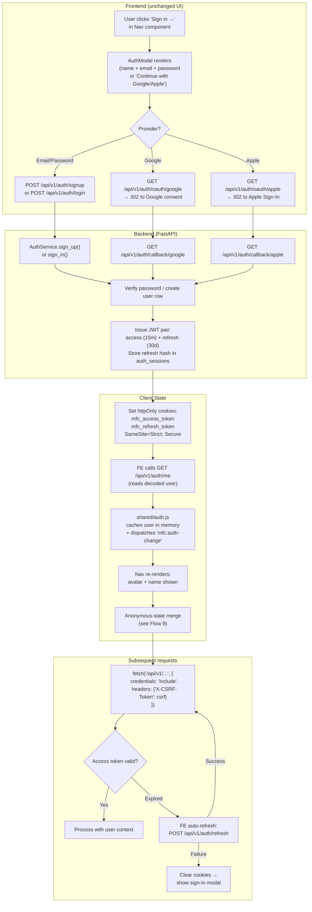
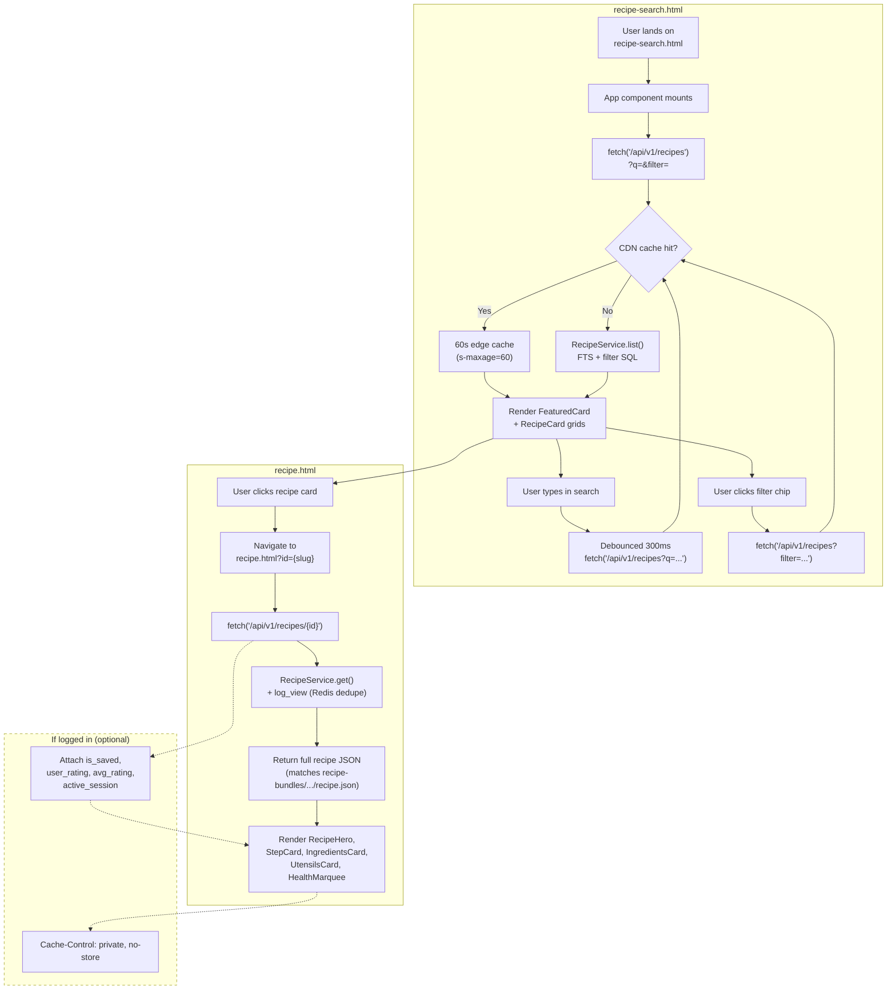
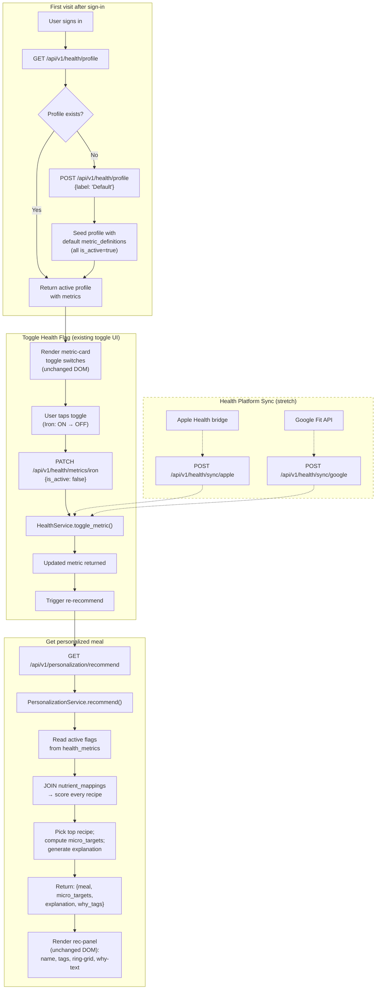
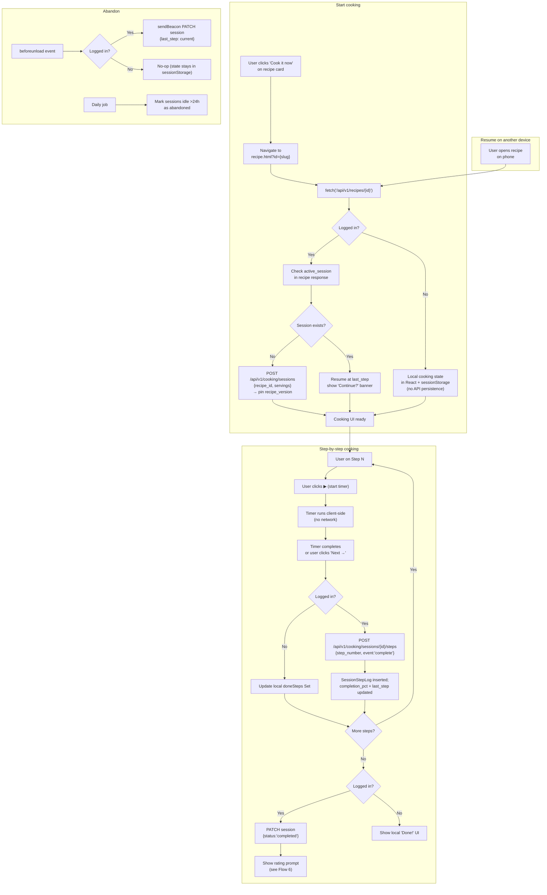
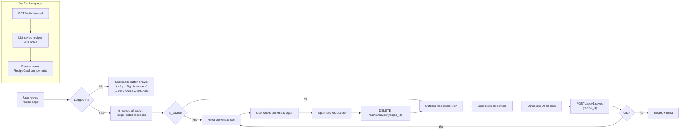
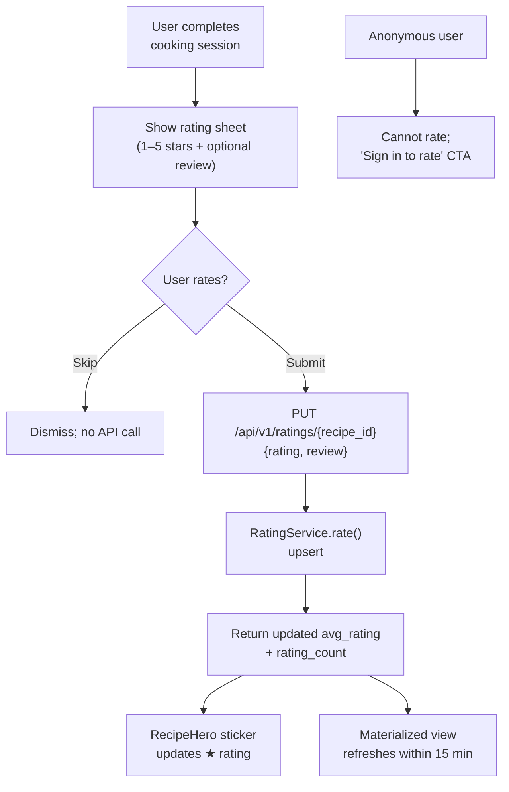
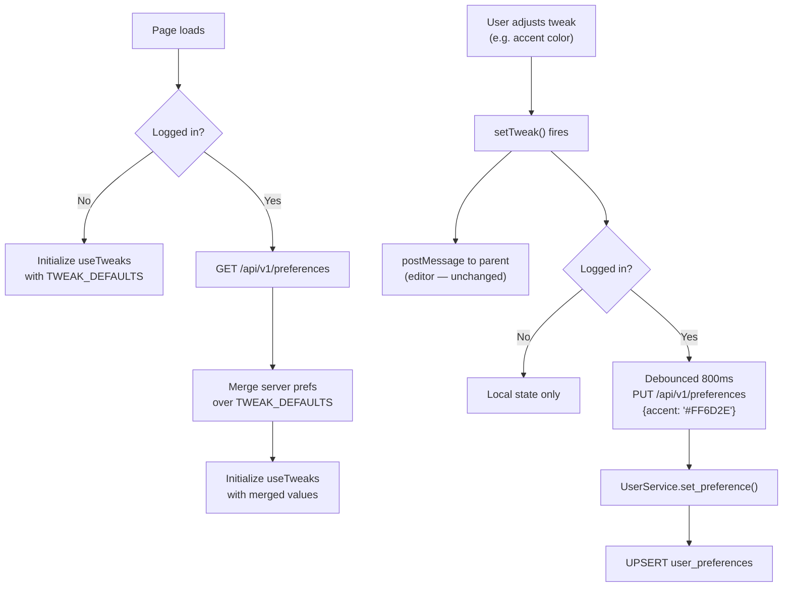
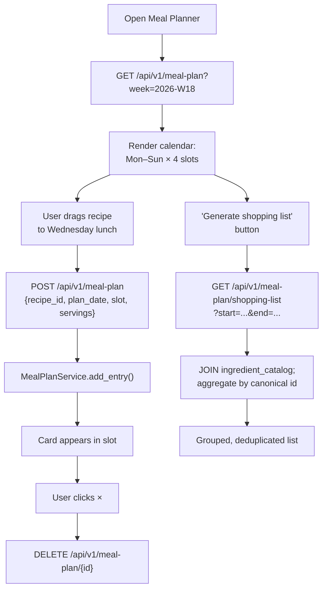
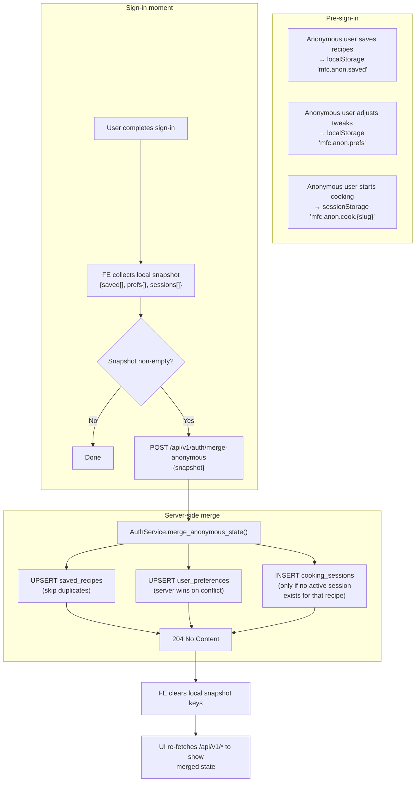
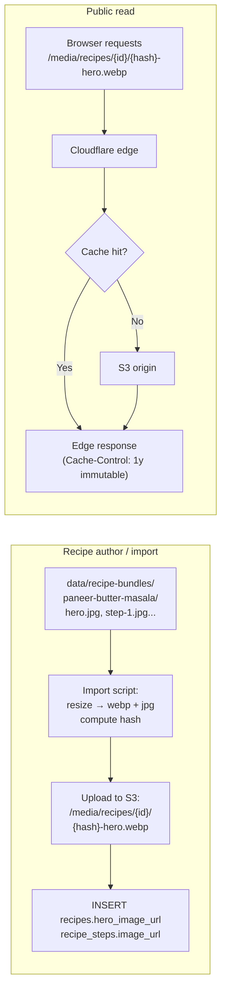

# High-Level Flow Diagrams

> Business and process flows for every major feature area. All flows are designed so anonymous users get full core value; authenticated users get persistence + personalization.

---

## 1. Authentication Flow

The current `shared/auth.js` stores a user object in localStorage with `provider: 'demo'`. The dynamic version replaces this with real JWT-based auth while preserving the exact same `{ id, name, email, avatar, provider }` contract and the `mfc:auth-change` CustomEvent.

### Key decisions:
- **httpOnly cookies** for JWTs — not localStorage — to prevent XSS theft.
- **CSRF**: double-submit cookie. A separate non-httpOnly `mfc_csrf` cookie carries a random value; clients echo it back in the `X-CSRF-Token` header for state-changing methods.
- **Silent refresh**: a fetch wrapper retries once on 401 with the refresh endpoint.
- The `AuthModal` component stays pixel-identical; only `handleSubmit()` swaps from `window.MFC.auth.signIn(...)` (local) to an API call.

---

## 2. Recipe Search & View Flow (Anonymous)

This flow must work **without any login**. The frontend currently fetches `data/recipes.json` and `data/recipe-bundles/{id}/recipe.json`. The dynamic version serves the same shapes from API endpoints, with edge caching for SEO + performance.

### Key decisions:
- API responses **exactly match** the current static JSON shapes (camelCase preserved).
- `recipe-search.html` currently has an inline `RECIPES` array as fallback + fetches `data/recipes.json`. Post-migration, the inline array becomes a build-time-injected emergency fallback only (kept identical to live data via daily CI snapshot).
- Search uses PostgreSQL full-text search (`search_vector` column) rather than client-side filtering, so 1000+ recipes are still snappy.
- Anonymous detail responses are CDN-cacheable; logged-in detail responses bypass CDN due to enrichment.

---

## 3. Personalization Flow (Authenticated)

Maps to the "Your blood work, on a plate" section on the landing page. Currently, `HEALTH_METRICS`, `PERSONA_MEALS`, and `microTargets()` are hardcoded in `index.html`. The dynamic version pulls from the user's health profile and the data-driven recommendation engine ([07-personalization-engine.md](07-personalization-engine.md)).

### Anonymous landing-page personalization
The landing page already shows the "Your blood work" demo with hardcoded metrics. For anonymous users this **stays exactly as-is** — driven by the inline `HEALTH_METRICS` and `PERSONA_MEALS` arrays. After sign-in, the same DOM is hydrated from the API response. No layout shift.

---

## 4. Guided Cooking Session Flow

The current `recipe.html` has step navigation, timers, and an ingredient checklist — all client-side. Anonymous users keep that exact behavior. Authenticated users get cross-device persistence.

### Key decisions:
- **Timers stay 100% client-side** — no WebSocket. Only step transitions and heartbeats hit the API.
- Anonymous users get **sessionStorage** for in-tab persistence (refresh-safe) but no cross-device.
- A 30-second heartbeat (`PATCH /sessions/{id}` with `last_step`) prevents stale sessions when users walk away.
- Recipes are versioned: in-progress sessions always read from the pinned `recipe_version` snapshot, so an admin edit never breaks an active cook.

---

## 5. Save / Bookmark Recipe Flow (Authenticated)

---

## 6. Rating & Review Flow (Authenticated)

---

## 7. Preference Persistence Flow (Authenticated)

The tweak panel currently has no persistence — preferences reset on reload. The dynamic version syncs server-side for logged-in users while keeping the editor `postMessage` contract intact.

---

## 8. Meal Plan Flow (Authenticated — Stretch)

---

## 9. Anonymous → Authenticated State Migration (NEW)

The site is anonymous-first, but anonymous users build local state: bookmarks, tweak panel, in-progress cooking. We must not lose that state on first sign-in.

### Conflict rules
- **Saved recipes**: union; user's anonymous note discarded if a server note already exists.
- **Preferences**: server wins (user might have synced from another device since this anonymous session began).
- **Cooking sessions**: only migrate the most recent anonymous session per recipe; skip if user already has an active session for that recipe.

---

## 10. Image / Media Delivery Flow

Hashed filenames mean we never have to bust caches; replacing an image just inserts a new URL.

---

## Process Summary Table

| Flow | Auth Required | Endpoints Involved | Frontend Changes |
|------|:------------:|---------------------|------------------|
| Auth (sign up / in / out) | — | `/api/v1/auth/*` | `shared/auth.js` internals only |
| Recipe search | ❌ | `GET /api/v1/recipes` | Swap `fetch()` URL |
| Recipe detail | ❌ | `GET /api/v1/recipes/{id}` | Swap `fetch()` URL |
| Health profile | ✅ | `/api/v1/health/*` | Wire to existing toggle UI |
| Personalization | ✅ | `GET /api/v1/personalization/recommend` | Replace `pickMeal()` call |
| Cooking session | ✅ | `/api/v1/cooking/*` | Add session ID + heartbeat |
| Save recipe | ✅ | `/api/v1/saved/*` | Activate bookmark button |
| Rate recipe | ✅ | `/api/v1/ratings/*` | Add post-cook rating sheet |
| Preferences | ✅ | `/api/v1/preferences` | Wire into `useTweaks()` hydrate + debounced PUT |
| Meal planner | ✅ | `/api/v1/meal-plan/*` | New page (stretch) |
| Anonymous → auth merge | ✅ (just-in-time) | `POST /api/v1/auth/merge-anonymous` | New post-sign-in side-effect |
| Media delivery | ❌ | CDN / S3 | None (URLs already in JSON) |
