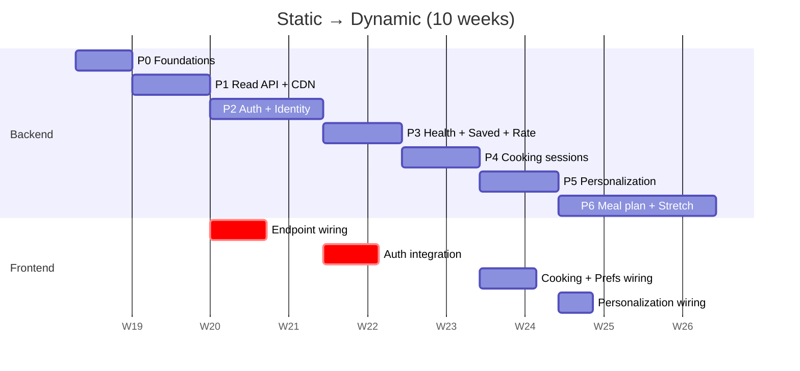

# Migration Plan

> Phased delivery from the current static GitHub Pages site to the dynamic, personalized application.
> The site stays live and shippable at every checkpoint. Every phase has explicit ship criteria and a rollback recipe.

---

## Guiding Constraints

1. **Zero UI/UX regression** at any phase — visual diff CI gate (Percy or Playwright pixel snapshots) on `index.html` / `recipe-search.html` / `recipe.html`.
2. **Anonymous parity at all times** — the public site must continue working with at most a 60-second cache delay if the API is down.
3. **No frontend framework rewrite** — every HTML page stays self-contained. `shared/auth.js` is the only JS that may grow.
4. **Reversible** — each phase ships behind a feature flag (`window.MFC_FLAGS = { useApi: true, ... }`); flipping the flag back is a one-line revert.

---

## Phase Map

---

## Phase 0 — Foundations (Week 1)

**Goal**: scaffold the backend repo, deploy targets, and CI without touching the live site.

**Deliverables**:
- `backend/` package: FastAPI skeleton, SQLAlchemy 2.0 async setup, Alembic, Pydantic v2.
- `docker-compose.yml`: app + Postgres 16 + Redis 7 + MinIO (local S3).
- GitHub Actions: lint (`ruff`), type-check (`mypy`), test (`pytest`), build image, push to GHCR.
- Hosting: Fly.io app provisioned (2 regions: BLR, FRA). Supabase project created (Postgres + Auth + Storage). Cloudflare zone + DNS.
- `dynamic/openapi.snapshot.json` placeholder with health endpoint only.

**Ship criteria**:
- `GET /api/v1/health/live` returns `200 {"status":"ok"}` from prod URL.
- CI green on a no-op PR.

**Rollback**: N/A — nothing user-facing yet.

---

## Phase 1 — Read API + CDN (Week 2)

**Goal**: replace `data/recipes.json` and `data/recipe-bundles/{id}/recipe.json` fetches with API calls. **No auth, no writes.** Anonymous users get the dynamic experience first.

**Backend**:
- Tables: `recipes`, `recipe_versions`, `recipe_ingredients`, `recipe_steps`, `recipe_utensils`, `recipe_tags`, `recipe_health_facts`, `ingredient_catalog`, `ingredient_aliases`, `recipe_views`.
- Import script `scripts/import_recipes.py`:
  1. Read every `data/recipe-bundles/{id}/recipe.json`.
  2. Upload `hero.jpg` and `step-*.jpg` to S3 with content-hashed filenames.
  3. Resolve free-form ingredient names against `ingredient_aliases`; insert any unmapped names into `ingredient_catalog` (manual review pass before phase 5).
  4. Insert recipe + steps + ingredients + tags. Snapshot v1 into `recipe_versions`.
  5. Verify row counts match input file counts.
- Endpoints: `GET /api/v1/recipes`, `GET /api/v1/recipes/{id}`, `POST /api/v1/recipes/{id}/view`.
- Cloudflare cache rules: `/api/v1/recipes*` cacheable, `Vary: Cookie`.

**Frontend** (one PR):
- Add `shared/api.js` (the fetch wrapper) and `shared/flags.js` (the feature-flag reader). **`shared/auth.js` is NOT touched in this phase** — it stays in legacy demo mode until Phase 2.
- `recipe-search.html`: `fetch('data/recipes.json')` → `fetch('/api/v1/recipes')` via `window.MFC.api.call(...)`, gated behind `window.MFC_FLAGS.useApi`.
- `recipe.html`: same gate; existing static-bundle fetch is the fallback.
- `recipe-search.html` inline `RECIPES` array stays as last-resort emergency fallback (refreshed nightly by CI from the live API).

**Ship criteria**:
- Visual diff on three pages: 0 changed pixels above 0.1% threshold.
- p95 search-bar latency ≤ 250 ms (cold) / ≤ 50 ms (CDN hit).
- All 10 existing recipes render identically with API as source.
- 1-day soak with `useApi=true` for 10% of traffic (Cloudflare worker A/B).

**Rollback**:
1. Set `window.MFC_FLAGS.useApi = false` (one-line `index.html` commit).
2. Site serves static `data/*.json` again. Backend stays running for next phase.

**Risks**:
- *CORS misconfiguration on first prod deploy*. Mitigation: same-origin via Cloudflare path routing — no CORS needed for site origin.
- *Image URL drift*. Mitigation: keep `data/recipe-bundles/` checked in until phase 6; CI verifies that S3 URLs return 200 for every recipe bundle.

---

## Phase 2 — Auth + Identity (Weeks 3–4)

**Goal**: real user accounts. Sign-in modal works. Anonymous browsing untouched.

**Backend**:
- Tables: `users`, `oauth_identities`, `auth_sessions`.
- Endpoints: full `/api/v1/auth/*` (signup, login, OAuth Google + Apple, refresh, logout, me, verify-email, forgot/reset-password, sessions, account delete, **merge-anonymous**).
- Email: Resend templates for verification + reset.
- Supabase Auth wired for OAuth providers (or self-hosted GoTrue). Apple Sign-In domain-verified.
- Audit events: `auth.signup`, `auth.login`, `auth.logout`, `auth.refresh_reuse_detected`.

**Frontend**:
- Rewrite `shared/auth.js` internals (line-by-line guide in [06-frontend-integration.md](06-frontend-integration.md)):
  - `getUser()` → returns in-memory cache hydrated from `GET /api/v1/auth/me`.
  - `signIn()` → posts to `/api/v1/auth/login` (or opens OAuth redirect).
  - `signOut()` → posts to `/api/v1/auth/logout`.
  - `mfc:auth-change` event still fires.
- `AuthModal` form: add password field (currently only name+email). DOM tree unchanged; one new `<input type="password">` slot reusing existing input styles.
- Anonymous-state merge: collect localStorage/sessionStorage snapshot at sign-in success; POST to `/api/v1/auth/merge-anonymous`; clear local state on success.

**Ship criteria**:
- Email sign-up + verification round-trip works from prod.
- Google + Apple OAuth round-trips work from prod (both domains verified).
- A logged-in user reload preserves auth state without flicker.
- Sign-out from one device reflects on another within 15 minutes (access token TTL).
- Account-delete soft-deletes immediately; hard-purge job runs nightly.

**Rollback**:
- Frontend flag `window.MFC_FLAGS.useAuth = false`: hides sign-in button + reverts `shared/auth.js` to legacy demo mode. Auth backend stays online but unused.
- If a critical auth bug ships: kill switch on Cloudflare can route `/api/v1/auth/*` to a maintenance JSON.

**Risks**:
- *Cookie SameSite issues across subdomains*. Mitigation: same-origin via Cloudflare path routing → cookies are first-party.
- *Apple Sign-In private-relay emails*. Mitigation: nullable `email` + identity-key user-lookup.
- *Refresh-token theft*. Mitigation: rotation on every refresh, reuse-detection triggers global sign-out.

---

## Phase 3 — Health, Saved, Ratings (Week 5)

**Goal**: simple authenticated CRUD wired to existing UI affordances.

**Backend**:
- Tables: `health_profiles`, `health_metrics`, `metric_definitions`, `saved_recipes`, `recipe_ratings`, `user_preferences`.
- Endpoints: `/api/v1/health/*`, `/api/v1/saved/*`, `/api/v1/ratings/*`, `/api/v1/preferences`.
- Materialized view `recipe_rating_stats` + 15-min refresh job.
- Seed `metric_definitions` from `HEALTH_METRICS` array.

**Frontend**:
- Health profile section on landing: when logged in, hydrate metrics from API; existing `Personalize` component unchanged.
- Recipe-card bookmark icon: enable `onClick` to call save/unsave; optimistic UI.
- Post-cook rating sheet (new component using existing button styles).
- `useTweaks` hook: add hydrate-from-API on mount + debounced PUT on change.

**Ship criteria**:
- All toggles in the "Your blood work" section round-trip to the DB.
- Saved recipes appear at `/recipe-search.html?filter=saved` (new chip — or behind a gate if filter is too prominent; defaults to existing chips).
- Tweak panel changes survive a logout-login on a different device.

**Rollback**: feature flag `useHealth`, `useSaved`, `useRatings` per surface. Each can be turned off independently.

---

## Phase 4 — Cooking Sessions (Week 6)

**Backend**:
- Tables: `cooking_sessions`, `session_step_logs`.
- Endpoints: `/api/v1/cooking/*`.
- Daily abandon-stale-sessions job.

**Frontend**:
- `recipe.html`: on mount, if logged in, check for active session and offer "Continue?" banner.
- StepCard `onAdvance` → POST step event; debounced 800 ms heartbeat with `last_step`.
- `beforeunload`: `navigator.sendBeacon` PATCH for session.

**Ship criteria**:
- Resume on a second device works for ≥ 95% of test cases.
- A Cooking session never shows a different step list than the one started — verified by a `recipe_version` integration test that edits a recipe mid-flight.
- p95 step-event endpoint ≤ 100 ms.

---

## Phase 5 — Personalization Engine (Week 7)

**Backend**:
- Tables: `nutrient_mappings`. Seed from a curated CSV (built by exporting the implicit map in `PERSONA_MEALS` plus a content-team review pass).
- `PersonalizationService` + `GET /api/v1/personalization/recommend` per [07-personalization-engine.md](07-personalization-engine.md).
- Cache recommendation per `(user_id, active_flag_set)` in Redis with 5-minute TTL; bust on metric change.

**Frontend**:
- `Personalize` component: when logged in, fetch from API instead of computing from `pickMeal()`. Same response shape used to render.

**Ship criteria**:
- A recommendation is returned in ≤ 300 ms p95 (cached) / ≤ 800 ms (cold).
- Across every (active_flag_set) combination, the recommendation is **deterministic and explainable** — content team signs off on the explanation strings.
- Anonymous landing-page demo continues to use static `PERSONA_MEALS` (no functional change).

---

## Phase 6 — Stretch (Weeks 8–10)

| Feature | Surface |
|---------|---------|
| Meal planner page | New `meal-plan.html`, reuses existing card components |
| Aggregated shopping list | API + UI on planner |
| Apple Health / Google Fit sync | New settings page |
| Account export (GDPR) | Settings → "Download my data" |
| Admin recipe editor | Out of scope for V1 |

Each ships behind its own flag; deferring is safe.

---

## Data Migration Scripts

| Script | What it does |
|--------|--------------|
| `scripts/seed_metric_definitions.py` | Inserts iron / b12 / sodium / fiber rows from `HEALTH_METRICS` constant. |
| `scripts/seed_nutrient_mappings.py` | Reads `dynamic/nutrient-mappings.csv` (curated) and inserts rows. |
| `scripts/import_recipes.py` | Walks `data/recipe-bundles/`, uploads media, inserts recipe + nested rows, snapshots v1. Idempotent on re-run (UPSERT by slug). |
| `scripts/build_emergency_fallback.py` | Runs nightly in CI: queries the live API, writes the response into `data/recipes.json` so the static fallback stays current. |
| `scripts/anonymize_export.py` | Used in CI for fixture generation; **not** for prod data. |

All scripts are idempotent. Re-run safety is a CI test (run twice, assert second run is a no-op).

---

## Feature Flag Reference

`window.MFC_FLAGS` defaults defined inline in each HTML page. Server overrides via `<meta>` tag injected at deploy time.

| Flag | Default | Controls |
|------|---------|----------|
| `useApi` | `false` → `true` (Phase 1 cutover) | Recipe list + detail fetches |
| `useAuth` | `false` → `true` (Phase 2) | Sign-in button visibility, `shared/auth.js` mode |
| `useHealth` | `false` → `true` (Phase 3) | Health-profile API hydration |
| `useSaved` | `false` → `true` (Phase 3) | Bookmark button on cards |
| `useRatings` | `false` → `true` (Phase 3) | Post-cook rating sheet |
| `useCooking` | `false` → `true` (Phase 4) | Cooking-session persistence |
| `useRecommend` | `false` → `true` (Phase 5) | Personalize component data source |
| `useMealPlan` | `false` (stretch) | Meal-plan page link in nav |

---

## Rollback Recipes

### Catastrophic (whole API down)
1. Cloudflare worker route `/api/v1/*` to a maintenance JSON (`503 + Retry-After: 600`).
2. `window.MFC_FLAGS.useApi = false` deploy (GitHub Pages auto-rebuilds in ≤ 5 min).
3. Site serves static `data/*.json`; auth-gated features hidden.

### Auth bug only
1. `window.MFC_FLAGS.useAuth = false`. Read API stays online.

### Single feature regression
1. Disable that flag (e.g. `useRecommend = false`). Frontend falls back to inline arrays.

### Database corruption
1. Restore latest nightly `pg_dump` to a hot-standby instance.
2. Repoint app via Fly.io secret rotation.
3. Replay `audit_events` from the gap window if persisted to S3 too.

---

## Acceptance Test Matrix

| Surface | Anonymous | Logged-in | Logged-in (cross-device) |
|---------|:---------:|:---------:|:------------------------:|
| Landing renders | ✅ | ✅ | ✅ |
| Recipe search | ✅ | ✅ | ✅ |
| Recipe detail | ✅ | ✅ | ✅ |
| Step timers + checklist | ✅ | ✅ | ✅ |
| Voiceover | ✅ | ✅ | ✅ |
| Save / bookmark | — | ✅ | ✅ (synced) |
| Ratings | — | ✅ | ✅ (synced) |
| Health profile | — | ✅ | ✅ (synced) |
| Personalized recommend | — | ✅ | ✅ |
| Cooking session resume | — | sessionStorage | ✅ (synced) |
| Tweak panel persistence | session | ✅ | ✅ (synced) |
| Meal planner | — | ✅ | ✅ |

Each row has at least one Playwright test fixture in `tests/e2e/`.
